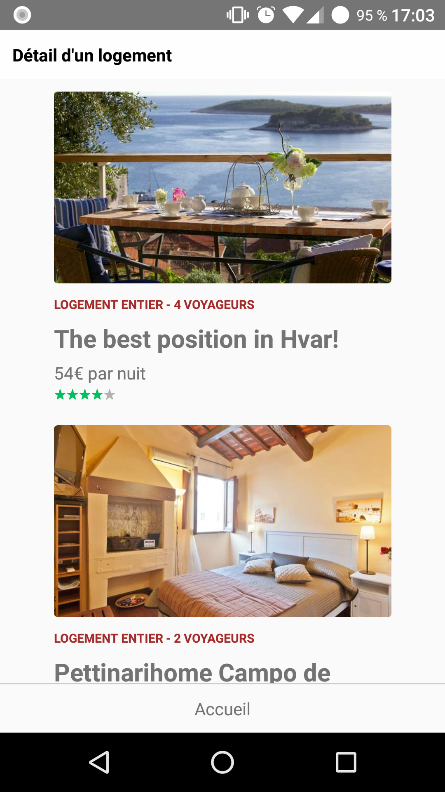

# TP 04.1 : Construire son interface : layout & styles

## Objectifs

Améliorer l'apparence et le layout de l'application grâce aux styles.

## Préparatifs
1. Repartir des fichiers du TP précédent ou du dossier ReactBnb fourni. **NB :** Si vous repartez de vos fichiers, récupérer le dossier `src/images` fourni ici

## Instructions
1. Ajouter des images dans les composants `HousingListItem` et `HousingDetail` (l'url des images utilisées pour les vignettes se trouve dans la propriété `listing.picture.picture` du fichier json)
1. Styler les composants `HousingListItem` et `HousingList` de manière à obtenir le résultat suivant: 
	
	+ L'image doit avoir des bords arrondis de 3 pixels, un largeur de 273 pixels et une marge inférieure de 20 pixels
	+ Le type de logement doit être de couleur `brown`, en majuscule, en gras, avoir une taille de police de 10 pixels et une marge inférieure de 7 pixels
	+ La description doit être en gras, avoir une taille de police de 20 pixels et une marge inférieure de 5 pixels
	+ Le prix doit avoir une marge inférieure de 3 pixels
	+ La note doit être de couleur 'aqua' avec une taille de 10 pixels.

## Pour aller plus loin :
1. Dans le composant `HousingList`, ajouter un header avec les caractéristiques suivantes :
	+ affiché en haut de l'écran et sur toute la largeur de l'écran
	+ par dessus la liste des logements (position absolute)
	+ avec un fond gris clair transparent
	+ contenant un cadre blanc opaque avec une bordure de 1 px et de couleur `#ddd`
	+ ce cadre blanc opaque, contiendra sur la même ligne un Text `"<-"` et un autre Text "Partout"
1. Créer un composant `StarRating` permettant d'afficher la note du logement sous forme d'étoiles
	- Accepte les props suivantes
		*  `rating`: Permet de définir la note
		*  `size`: Permet de définir la taille des étoiles
	- Affiche 5 étoiles dont une proportion d'étoile vertes (`src/images/star-active.png`) correspondant à la note du logement, le reste affichant des étoiles grises (`src/images/star.png`)
1. Mettre en forme l'écran de détail afin d'obtenir le résultat suivant: 
	 
	L'écran de détail devra afficher deux informations supplémentaires:
	- Le prénom de l'hôte: `listing.user.first_name`
	- La photo de l'hôte: `listing.user.picture_url`